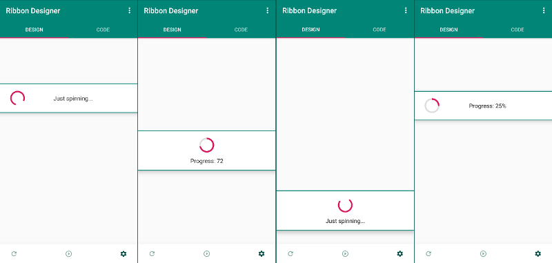
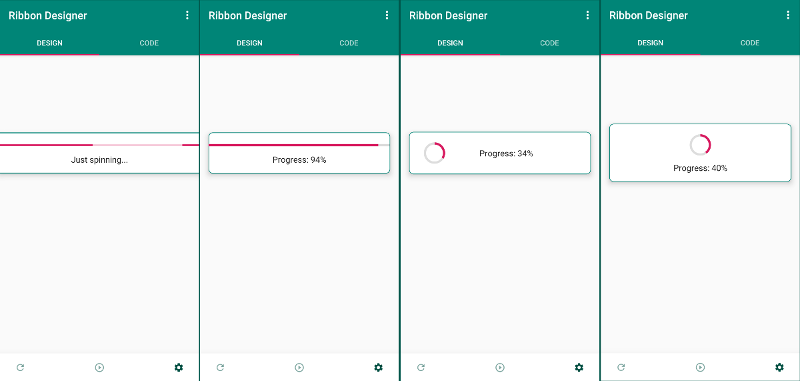
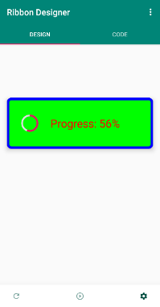

# ProgressRibbon -- A highly customisable ProgressBar and ProgressDialog replacement

A Free and Open Source, heavily customisable compound Android widget to better display progress.

Why another widget? Because Google's design guidelines (the reasoning behind deprecating ProgressDialog) are not always sound (Think abut the UX disaster the Floatng Action Button is).
In the real world, there *are* usecases when you want a load/progress indicator *should* block the underlying layout. or just visually draw over, without blocking. besides, show/hide delays should 
be an integral part of any load/progress indicator, since you will not always know upfront whether you will even need one.

Sprinkle in some useful, and some less useful, plus some very convenient functionality, and you get... the `ProgressRibbon`! :) (*Yay.*) 


### Features

ProgressRibbon is an extremely customisable compound widget, that combines a `ProgressBar` and a `TextView `in one convenient package, expanding the functionality of both.

- Highly customisable appearance
- Free show/hide animations (3 types)
- Delayed showing and hiding
- Two indeterminate progressbar styles (circular or flat)
- Two **determinate** progressbar styles (**circular** or flat)
- Secondary progress in both circular and flat ProgressBars
- Report progress as percentage of max value (optionally)
- Show as a ribbon (edge to edge), a dialogue (like old ProgressDialogue) or without a background
- Circular progressbar can display text beside or underneath the bar
- Block the underlying layouts or allow click/tap/scroll under
- And **a lot** more advanced stuff

### Screenshots

They say that a picture is worth more than a thousand words. So here's a short novella then:



<br />



<br />

...literally any colour size or appearance...

<br />




### Get it

#### JFrog Bintray

[  ](https://bintray.com/atlantic-omnibus/androidosslibs/progressribbon/_latestVersion)

#### Jcenter

Make sure you have `jcenter()` in your project level `build.gradle`, like so:

```Gradle
buildscript {
    repositories {
    
        /*...*/
        
        jcenter()
        
        /*...*/
    }
    
    /*...*/
} 
``` 

Then in your app/module level `build.gradle`:
    
```Gradle
dependencies {

    /*...*/
    
    implementation 'com.gitlab.atlanticomnibus:progressribbon:1.0'
    
    /*...*/
     
} 
```

<br />

### Usage examples

**Create a `ProgressRibbon` in a layout XML (shows automatically with a 300 ms delay)** 

```XML
<com.atlanticomnibus.progressribbon.ProgressRibbon
    android:id="@+id/progress_ribbon"
    android:layout_width="match_parent"
    android:layout_height="match_parent"
    app:isIndeterminate="false"
    app:showDelay="300"
    app:hideDelay="500"
    app:reportProgressAsMaxPercent="true"
    app:animationType="fade"
    app:animationDuration="400"
    app:dialogueMode="true" />
```
<br />

**Create a `ProgressRibbon` in Java code, which is not attached to any `ViewGroup` (orphan, attaches to Window)**


```Java

/**
 * Declare the ProgressRibbon with `newInstance()` method and show with a 300 millicsecnd delay
 * (Ribbon will be orphan, attached to the Window)
 */
 
ProgressRibbon progressRibbon = ProgressRibbon.newInstance()
                                                  .setReportProgressAsMaxPercent(true)
                                                  .setAnimationType(ProgressRibbon.ANIMATE_FADE)
                                                  .setAnimationDuration(400)
                                                  .setRibbonInDialogueMode(true)
                                                  .show(300);
              
              
```

<br />

**Create a `ProgressRibbon` with the default constructor** 

```Java              
// Create an instance of the ProgressRibbon and attach it to a ViewGroup in your layout
ProgressRibbon progressRibbon = new ProgressRibbon(mContext, parentViewGroup);

// Or create one in orphan mode, that wudl be attached to the Window directly
ProgressRibbon progressRibbon = new ProgressRibbon(mContext);

//Then apply some settings
progressRibbon.setIndeterminateState(ProgressRibbon.DETERMINATE)
    .setShowDelay(300)
    .setHideDelay(500)
    .setReportProgressAsMaxPercent(true)
    .setAnimationType(ProgressRibbon.ANIMATE_FADE)
    .setAnimationDuration(400)
    .setRibbonInDialogueMode(true);
```

<br />

**Using your `ProgressRibbon`**

```Java  
// If added in XML, reference it first
ProgressRibbon progressRibbon = findViewById(R.id.progress_ribbon;) 
 
 
// Whenever you need to show your Ribbon
progressRibbon.show();

// Or ot show it overriding the pre-set delay
progressRibbon.show(500);

// To show without any delay
progressRibbon.showNoDelay();


// To adjust progress value (use any integer value)
progressRibbon.setProgress(1);
/*or*/
progressRibbon.incrementProgressBy(1);


// To change progress text any time
progressRibbon.setProgressText("Progress text");
/*or*/
progressRibbon.setProgressText(getResources().getString(R.string.ribbon_string);


// To hide Ribbon
progressRibbon.hide();

// To hide Ribbon without any delay
progressRibbon.hideNoDelay();

// To completely remove dynamically created Ribbon
progressRibbon.removeDynamicRibbon();
```

<br />

**Other methods to change the appearance/behaviour of the `ProgressRibbon`.**

```XML
    ...
    app:progressBarType="round|horizontal"
    app:min="50"
    app:max="200"
    app:ribbonElevation="5dp"
    app:ribbonPadding="36dp"
    app:borderThickness="5dp"
    app:borderColor="#FF0000"
    app:ribbonBackgroundColor="#00FF00"
    app:progressTextColor="#0000FF"
    app:progressTextSize="22sp
    />
```

<br />

```Java
progressRibbon
    .setProgressBarStyle(ProgressRibbon.BAR_HORIZONTAL)
    .setMin(50)
    .setMax(200)
    .setRibbonElevation(5) //setElevation(int) is also available, but it is not chainable
    .setRibbonPaddingTop(36)
    .setRibbonPaddingBottom(56)
    .setRibbonBorderSize(5)
    .setRibbonBorderColor("#FF0000")
    .setRibbonBackgroundColor("#00FF00")
    .setProgressTextColour("#0000FF")
    .setProgressTextSize(22);
```
<br />

For more details about these and **even more** available methods, refer to the Wiki.

### Copyright, Licensing and Contributions

Copyright (c) 2019 Attila Orosz

ProgressRibbon is licensed under the MIT license (See license file).

The development of this library happens on [GitLab](https://gitlab.com/atlantic_omnibus/open-source/progress-ribbon), which is an **open source** DevOps platform. The repository automatically gets pushed to GitHub as well for better discoverability. You are welcome to open any issues on GH, but if you want to contribute, please visit the [GitLab repo](https://gitlab.com/atlantic_omnibus/open-source/progress-ribbon).
